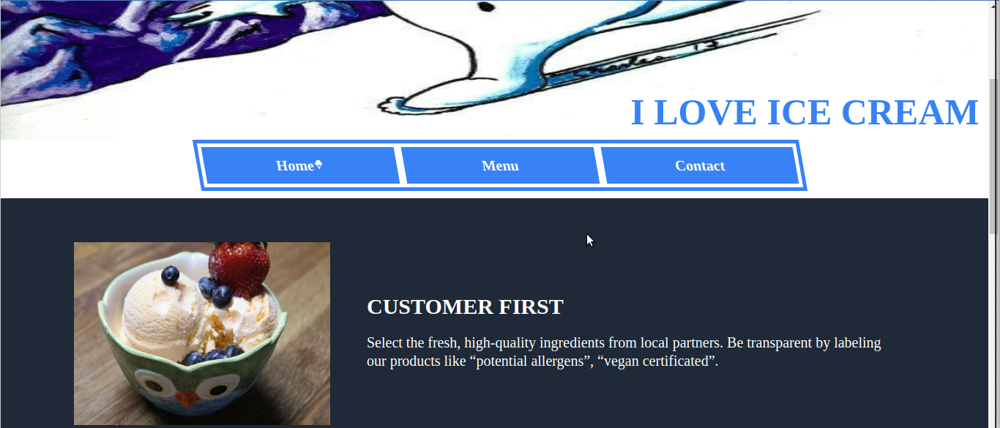

# 10.odin_restaurant_page

[Live preview](https://maxim55069633.github.io/10.odin_restaurant_page/)

In this project, I used webpack to bundle modules. This was a practice about manipulating DOM by dynamically rendering a simple restaurant homepage. 

I successfully overcome the following obstables:
1. Add a .gitignore file to my project so that I don’t have to sync the contents of node_modules to github.
2. Run `npx webpack --watch` to commit new changes to dist/index.html in real time.
3. Find [a website](https://css-tricks.com/the-shapes-of-css/) that teaches how to create different shapes using CSS

sample:

I use the following images from bing under the license: free to share and use commercially
1. [ice cream 1](https://cn.bing.com/images/search?view=detailV2&ccid=L0%2bFh8Fm&id=725C9A31EAF627AE2173F0E696850AD2FD2D071B&thid=OIP.L0-Fh8Fmiw5eayv87U1UYQHaE7&mediaurl=https%3a%2f%2fwww.foodista.com%2fsites%2fdefault%2ffiles%2f35551557663_4e8f07d085_k+(1).jpg&cdnurl=https%3a%2f%2fts1.cn.mm.bing.net%2fth%2fid%2fR-C.2f4f8587c1668b0e5e6b2bfced4d5461%3frik%3dGwct%252fdIKhZbm8A%26pid%3dImgRaw%26r%3d0&exph=1365&expw=2048&q=ice+cream&simid=608048734036707802&FORM=IRPRST&ck=AD91573802AABB1BF954FBBBBA928A4E&selectedIndex=0&qft=+filterui%3alicense-L2_L3_L4&ajaxhist=0&ajaxserp=0)
2. [ice cream 2](https://cn.bing.com/images/search?view=detailV2&ccid=9xQg9%2faf&id=872B665A27BDFD780A6E9D0D22D4890BE838B500&thid=OIP.9xQg9_afdJ0Rhro4fk_bEAHaFj&mediaurl=https%3a%2f%2fts1.cn.mm.bing.net%2fth%2fid%2fR-C.f71420f7f69f749d1186ba387e4fdb10%3frik%3dALU46AuJ1CINnQ%26riu%3dhttp%253a%252f%252fwww.foodista.com%252fsites%252fdefault%252ffiles%252fEC_stFace.jpg%26ehk%3dt2g2u%252fU63wQfVeT8In3ByCVBL%252b4JSUs0vQ4TIGLIVGo%253d%26risl%3d%26pid%3dImgRaw%26r%3d0%26sres%3d1%26sresct%3d1%26srh%3d800%26srw%3d1068&exph=397&expw=530&q=ice+cream&simid=608027830432592109&FORM=IRPRST&ck=7D615A55848377C9A90243AA456BA827&selectedIndex=23&qft=+filterui%3alicense-L2_L3_L4&ajaxhist=0&ajaxserp=0)
3. [ice cream 3](https://cn.bing.com/images/search?view=detailV2&ccid=PffMwxpf&id=A9E071BD26CA1E81CE28E5F051B9EE64C9C6FC22&thid=OIP.PffMwxpffoOyW3nZ2uDUrwHaE8&mediaurl=https%3a%2f%2fwww.exploreveg.org%2ffiles%2f2018%2f05%2fCrepeSpoon-1.6.18-5.jpg&cdnurl=https%3a%2f%2fts1.cn.mm.bing.net%2fth%2fid%2fR-C.3df7ccc31a5f7e83b25b79d9dae0d4af%3frik%3dIvzGyWTuuVHw5Q%26pid%3dImgRaw%26r%3d0&exph=2561&expw=3841&q=ice+cream&simid=608041969459734191&FORM=IRPRST&ck=3E2F1F06D6E302719CF46292C1397A70&selectedIndex=7&qft=+filterui%3alicense-L2_L3_L4&ajaxhist=0&ajaxserp=0)
4. [snowman](https://cn.bing.com/images/search?view=detailV2&ccid=TfBNE8Ih&id=AE7952CF2D884BC0A78F8266F6F908700B4D0D22&thid=OIP.TfBNE8Ih7H5FBtaGt7c_3wHaGP&mediaurl=https%3a%2f%2fimages-wixmp-ed30a86b8c4ca887773594c2.wixmp.com%2ff%2f064b17ec-2aa8-48a7-bb3c-7979ba875b9b%2fd6w07y4-4aaf6448-93e2-49c3-a04f-3f15f7a1e4d9.jpg%2fv1%2ffill%2fw_480%2ch_405%2cq_75%2cstrp%2ffrosty_the_snowman_by_halloranillustration_d6w07y4-fullview.jpg%3ftoken%3deyJ0eXAiOiJKV1QiLCJhbGciOiJIUzI1NiJ9.eyJzdWIiOiJ1cm46YXBwOjdlMGQxODg5ODIyNjQzNzNhNWYwZDQxNWVhMGQyNmUwIiwiaXNzIjoidXJuOmFwcDo3ZTBkMTg4OTgyMjY0MzczYTVmMGQ0MTVlYTBkMjZlMCIsIm9iaiI6W1t7ImhlaWdodCI6Ijw9NDA1IiwicGF0aCI6IlwvZlwvMDY0YjE3ZWMtMmFhOC00OGE3LWJiM2MtNzk3OWJhODc1YjliXC9kNncwN3k0LTRhYWY2NDQ4LTkzZTItNDljMy1hMDRmLTNmMTVmN2ExZTRkOS5qcGciLCJ3aWR0aCI6Ijw9NDgwIn1dXSwiYXVkIjpbInVybjpzZXJ2aWNlOmltYWdlLm9wZXJhdGlvbnMiXX0.p0FkySpXqN9hv8fqY38w7-VEOYDhaI8srncSKD9Z8Ow&cdnurl=https%3a%2f%2fts1.cn.mm.bing.net%2fth%2fid%2fR-C.4df04d13c221ec7e4506d686b7b73fdf%3frik%3dIg1NC3AI%252bfZmgg%26pid%3dImgRaw%26r%3d0&exph=405&expw=480&q=snowman&simid=608019017160933686&FORM=IRPRST&ck=32E1890323FD2C1B7B92B5D7A24F79CF&selectedIndex=135&qft=+filterui%3alicense-L2_L3_L4&ajaxhist=0&ajaxserp=0)